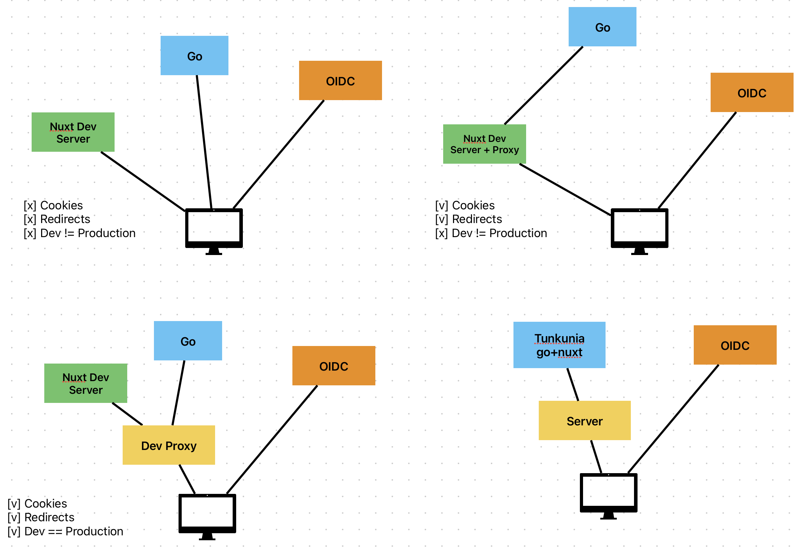

Preinstall:
- Go
- Mise
- Node (Can be installed via Mise)
- PNPM (Can be installed via Mise)
- Nuxt deps
- Astro deps
- Watchexec
- Redocly
- Scalar
- Caddy (Can be installed via Mise)

It requires to enable:

```env
GOEXPERIMENT='jsonv2'
```

# Using a Proxy in Development

To ensure our development environment mimics a production environments as well as to be able to create secure cookies over https, we need to use a proxy. We use Caddy to set up a reverse proxy that mimics our production environment. This approach was taken due to the comparison shown in this image:


