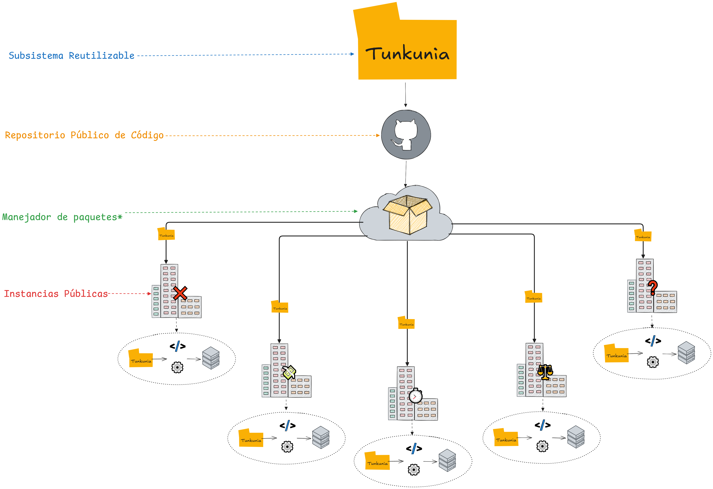
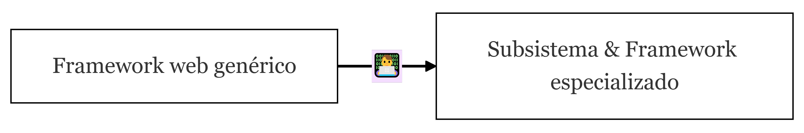
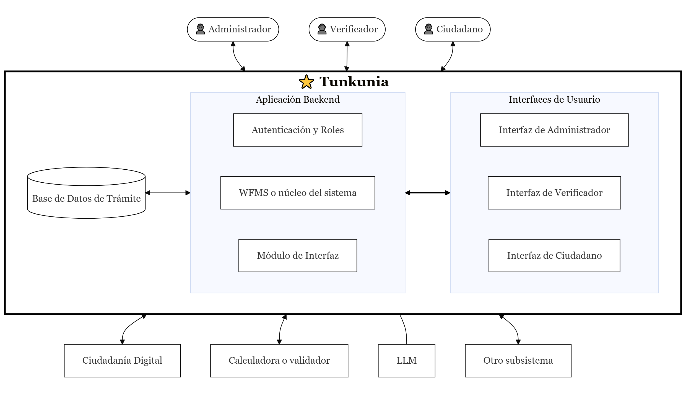

# Informe de modificaciones respecto al perfil de proyecto aprobado

## Datos de identificación

| Dato | Información |
| --- | --- |
| **Universidad** | Universidad Mayor de San Andrés |
| **Facultad** | Facultad de Ingeniería |
| **Carrera** | Ingeniería Electrónica |
| **Asignatura** | EN1040 — Proyecto de Grado |
| **Título del proyecto** | *Tunkunia*: Subsistema reutilizable de software libre para la gestión de flujos de trámite orientado al gobierno electrónico en Bolivia |
| **Estudiante / postulante** | Ernesto Carlos Arena Alarcon |
| **Docente asignado** | Jorge Mario León Gómez |
| **Tutor** | Jorge Antonio Nava Amador |
| **Fecha de elaboración** | 24 de agosto de 2026 |

## Objeto del informe

Este informe resume las modificaciones sustantivas realizadas durante el desarrollo del proyecto respecto al perfil aprobado.

## Relación de modificaciones

### 1. Título del proyecto

No se efectuaron cambios.

### 2. Problemática

Se conserva el contenido planteado en el perfil aprobado.

### 3. Objetivos

Se conserva el objetivo general del perfil, incluida la denominación «producto mínimo viable (MVP)».

Los objetivos específicos fueron reformulados para expresar de forma separada y verificable las actividades de modelado, identificación de requerimientos, diseño, implementación, validación, evaluación, publicación y documentación del subsistema.
Esta reformulación precisa el trabajo previsto sin cambiar la finalidad del objetivo general.

### 4. Justificación

Se conserva el contenido de la justificación del perfil aprobado.

### 5. Alcance y límites

El alcance fue precisado para distinguir entre el producto diseñado y la implementación exigida como entrega académica.
En este proyecto, el producto mínimo viable se entiende como un prototipo funcional de carácter académico y demostrativo.

Las principales precisiones son:

- Las capacidades se distinguen entre implementadas, simuladas y contempladas en el diseño arquitectónico.
- La validación se centra en la ejecución completa de casos representativos, su historial y la configuración de instancias institucionales ficticias.
- Las integraciones con servicios estatales se representan mediante contratos, interfaces, adaptadores o simulaciones; su conexión efectiva queda fuera de la implementación obligatoria.
- La edición interactiva de formularios será mínima y demostrativa, no un constructor visual de propósito general.
- La reutilización se demuestra mediante la adopción y configuración de una misma aplicación por distintas instituciones.
- La interoperabilidad, extensibilidad y disponibilidad del código fuente se mantienen como propiedades complementarias.
- La entrega comprende el repositorio público y artefactos desplegables bajo la licencia MIT.

### 6. Aproximación a la solución

La sección independiente de solución propuesta se retiró de la introducción de la memoria para evitar duplicación.
La solución se desarrolla con mayor detalle en los capítulos de requerimientos, arquitectura, diseño, implementación y validación.

La propuesta mantiene su orientación original: un subsistema de software libre que concentre capacidades comunes de los trámites y pueda configurarse para distintas instituciones.
Durante el desarrollo se concretaron las siguientes decisiones:

- Arquitectura de monolito modular con una aplicación cliente separada lógicamente.
- Go y Nuxt como tecnologías de implementación.
- Una SPA como interfaz de referencia sobre la API.
- Interfaces y adaptadores para las integraciones externas.

Las figuras del perfil se conservan como evidencia de la aproximación inicial:

### 7. Temario

El contenido se reorganizó en cuatro partes:

1. Presentación del proyecto.
2. Fundamentos e investigación.
3. Proceso de ingeniería de software.
4. Etapa conclusiva.

Los marcos de referencia y teórico se separaron de la introducción.
El proceso de software se desarrolló en capítulos de metodología, requerimientos, arquitectura, diseño e implementación.
La aplicación del subsistema pasó a presentarse como validación y resultados, seguida de conclusiones y recomendaciones.

### 8. Bibliografía

Se conservaron las fuentes del perfil y se añadieron referencias necesarias para profundizar en ingeniería de software, modelado de procesos y estándares relacionados.

### 9. Antecedentes

Los antecedentes se reorganizaron para exponer el recorrido desde el trámite tradicional y la evolución del gobierno electrónico hasta la experiencia del SIAI y el origen de Tunkunia.
Las definiciones conceptuales, la normativa detallada y los casos de trámite se trasladaron a los marcos correspondientes.

### 10. Situación actual

La situación actual se reorganizó en adopción digital, sistemas existentes, tendencias tecnológicas, trabajos académicos relacionados y brechas identificadas.
El desarrollo normativo y los fundamentos teóricos se trasladaron a los marcos de referencia y teórico, respectivamente.
